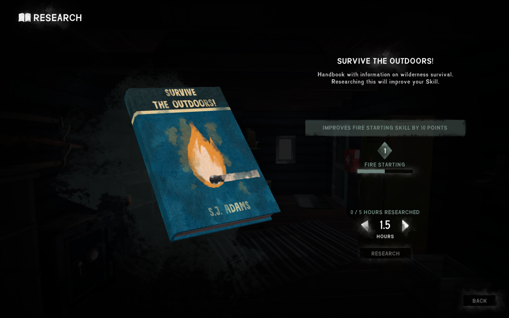
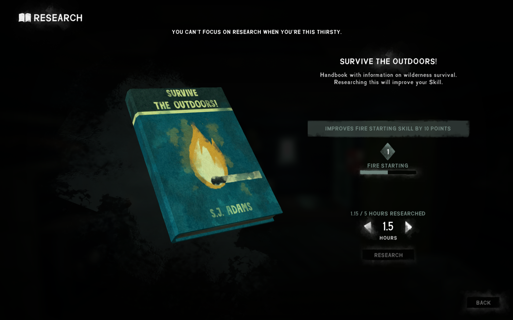
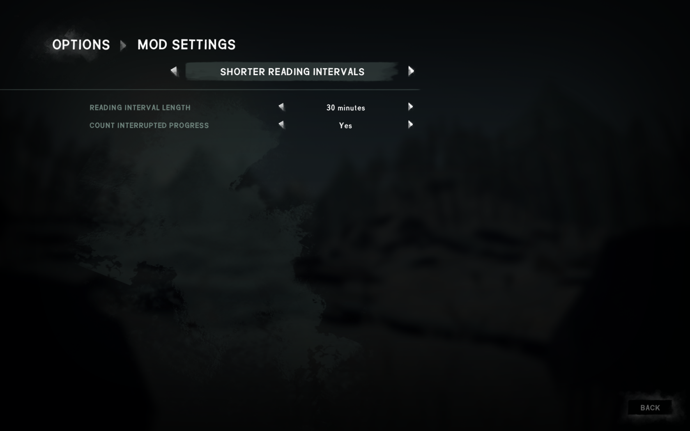

# ShorterReadingIntervals

A mod for The Long Dark that lets you research for shorter amounts of time and lets you interrupt research at any time without losing progress.

## Installation

1. If you haven't done so already, install the [Mod Loader](https://github.com/zeobviouslyfakeacc/ModLoaderInstaller)
2. Install the mod automatically by using [WulfMarius's Mod-Installer](https://github.com/WulfMarius/Mod-Installer/releases)

or

1. If you haven't done so already, install the [Mod Loader](https://github.com/zeobviouslyfakeacc/ModLoaderInstaller)
2. If you haven't done so already, install [ModSettings](https://github.com/zeobviouslyfakeacc/ModSettings) v1.1 or newer
3. Download the latest version of `ShorterReadingIntervals.dll` from the [releases page](https://github.com/zeobviouslyfakeacc/ShorterReadingIntervals/releases)
4. Move `ShorterReadingIntervals.dll` into the mods folder in your TLD install directory

Alternatively, you can download `ShorterReadingIntervals_with_ModSettings.zip` and extract it into your mods directory.

## Screenshots

Half-hour increments:

Interrupted research still counts:

## Configuration

The shortest reading interval and what happens to your research progress when you cancel researching / are interrupted can be changed:

1. In the main menu, select 'Options' and then 'Mod Settings'

   
2. Then, select 'Shorter Reading Intervals' from the mod list

   
3. Make your changes to the settings
4. Finally, press the 'Confirm' button to save your changes
